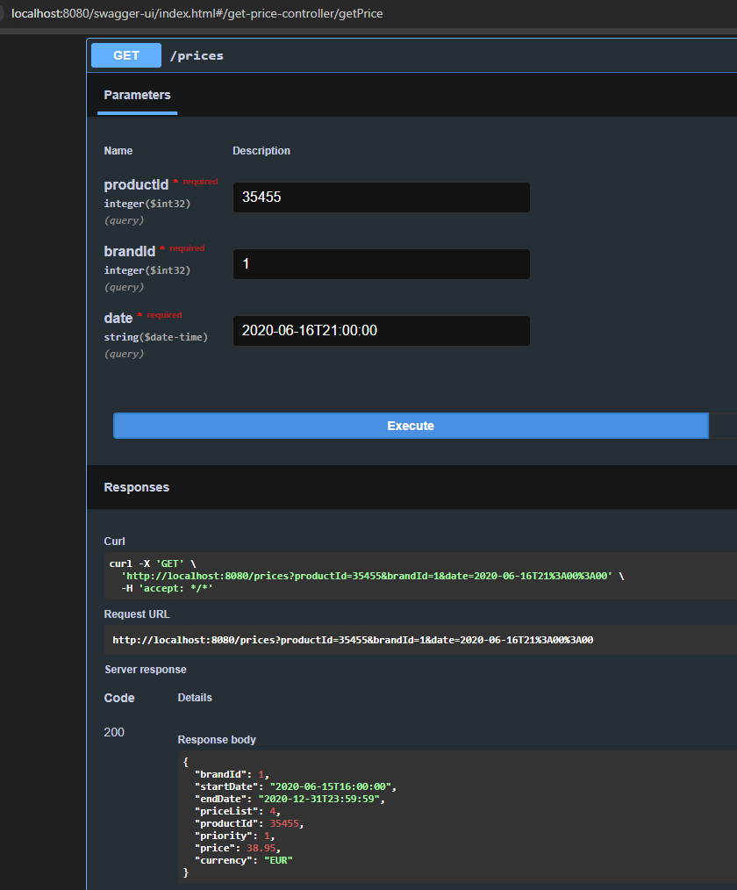

# Prueba Técnica Inditex Core Platform

## 📌 Resumen
Este proyecto implementa una API REST que expone un endpoint para, dado un `product_id`, un `brand_id` y una `date` concreta, recuperar la información del precio de ese producto en ese momento.

## 💡 Enfoque de la solución
Para resolver este desafío:
- se ha aplicado arquitectura hexagonal, vertical slicing y DDD como buenas prácticas de patrones de diseño.
- la aplicación se construye usando **Java 21** y **Spring Boot 3.3.4**. Y Maven para la gestión de dependencias y automatización de la build.
- se adopta JUnit 5 para implementar integration tests y unit tests.
- se asegura la cobertura de las pruebas solicitadas mediante quality assurance tests.
- el proyecto se ha dockerizado para poder trabajar en un entorno consistente y facilitar el despliegue de la app.
- se gestiona la base de datos con un modelo de persistencia en memoria H2.
- la API se ha documentando con springdoc.
- se ha añadido un base lógica para el manejo de excepciones personalizadas.
- se incluye una GitHub Action para validar que las Pull Requests tengan una build estable.


### 📁 Estructura del proyecto
Aplicar prácticas de clean architecture facilita la comprensión del proyecto y su escalabilidad.
```
src  
 ├── main  
 │   ├── java  
 │   │   └── com.inditex.challenge.coreplatform  
 │   │       ├── prices  
 │   │       │   ├── application    # Business logic  
 │   │       │   ├── domain         # Domain models  
 │   │       │   ├── infrastructure # Repositories and controllers  
 │   │       └── shared  
 │   │           └── exceptions     # Logic for custom exceptions  
 │   └── resources    # Database schema & data
 └── test  
     ├── unittests  
     ├── integrationtests  
     └── qa    # Use case testing
```

### 🔎 Implementación de la solución
Para desarrollar el código se han aplicado los principios SOLID y de buenas prácticas. Para gestionar la query a la base de datos se ha optado por una query nativa ya que la abstracción de jpa podía ser difícil de entender sin suficiente contexto.

## 🚀 Ejecutando la Aplicación
1. Clonar el repositorio
2. Build el proyecto con Docker
   ```
   docker-compose up
   ```
3. La aplicación ya estará levantada y accesible desde el puerto `8080`

### 📝 Probando el Endpoint /prices `8080`
Se puede revisar y testear la documentación de la API en:
```
http://localhost:8080/swagger-ui.html
```
El único endpoint que implementa la aplicación es:
* GET `/prices`
  - Con tres parámetros:
    * `productId` (Integer): id del producto
    * `brandId` (Integer): id de la marca
    * `date` (LocalDateTime): la fecha en la que se consulta el precio del artículo

Ejemplo de request:
```
curl "http://localhost:8080/prices?productId=35455&brandId=1&date=2020-06-14T10:00:00"
```



## 🧪 Casos de prueba
El enunciado esperaba que se validaran cinco casos de prueba, estos casos se han probado tanto manualmente como automatizados mediante una batería de tests de integración en la clase `PriceQATests.java`.
Estos tests se ejecutan cada vez que se lanza la aplicación o se hace una build del proyecto (también en la action `Maven Build Check`, automática en cada PR).

## ✏️ Posibles mejoras
- Securizar la app añadiendo Spring Security
- Mejorar el manejo de excepciones añadiendo un GlobalExeptionHandler, ControllerAdvice y un ErrorResponse.
- Validación de datos de entrada con Spring Validation
- Añadir anotaciones OpenAPI para mejorar la documentación
- Automatizar el despliegue con Docker y CI/CD
